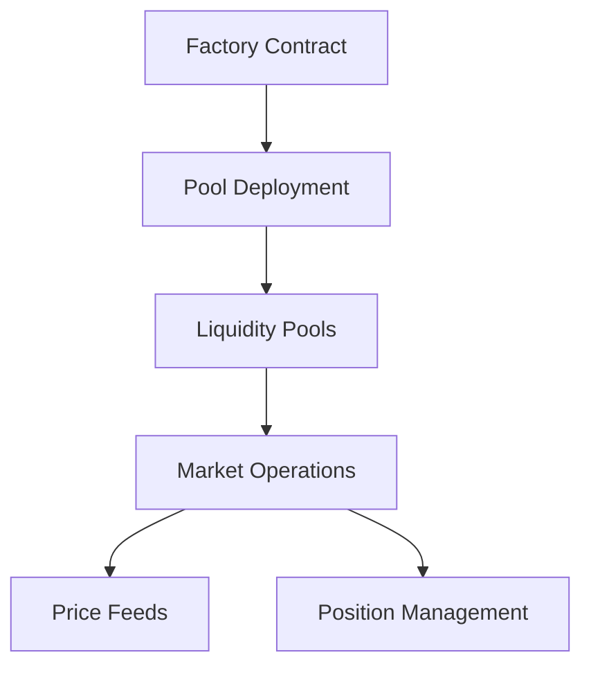
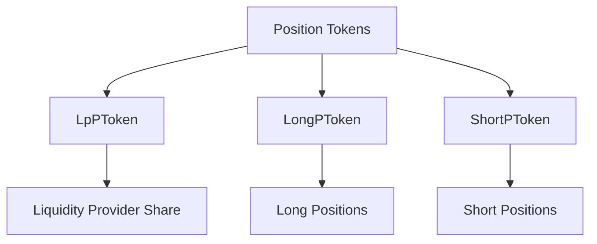

# Potentia Protocol

  

## 🌟 Overview

The Potentia Protocol is a cutting-edge, permissionless financial infrastructure designed for creating and managing power derivatives. Completely novel in its approach, the protocol builds upon the foundational concepts of power perpetuals, reimagining them into a versatile, efficient, and modular infrastructure for modern decentralized finance (DeFi). Potentia empowers users to take leveraged positions without the risk of long and short liquidations, provide liquidity, and access an advanced automated market-making (AMM) system based on asymptotic bonding power curves.

## 📖 Introduction

Traditional derivatives in financial markets often rely on outdated pricing models and carry inherent risks, such as liquidation during volatile conditions. Potentia Protocol introduces an entirely novel approach by adapting the foundational principles of power perpetuals, enabling the creation of advanced financial instruments where payoffs are determined by the power of an underlying asset's price.

Potentia eliminates reliance on traditional models like Black-Scholes and introduces a novel bonding curve mechanism for pricing, ensuring precision and adaptability to real-time market dynamics.

### 🎯 Designed For:
* Traders: Offering leveraged, non-liquidatable positions for stable participation during volatile markets.
* Liquidity Providers: Providing robust returns through dynamic funding mechanisms and automated market-making.
* Developers: Enabling seamless integration of modular derivative solutions into DeFi ecosystems.

## 💎 Key Features

### Power Derivatives:
Potentia allows users to trade derivatives based on the power of an underlying asset's price (e.g., squared, cubed etc. we have tested till the power of 16, beyond 16 is technically and fundamentally possible). This expands the range of available financial strategies, opening up new opportunities for traders and DeFi builders.

### Completely Novel and Non-Liquidatable Positions:
By design, positions are non-liquidatable, eliminating the risk of forced liquidations and ensuring stability during market volatility. Potentia redefines how traders engage with derivatives by providing a novel solution inspired by the foundational concepts of power perpetuals.

### Automated Market Maker (AMM):
The protocol uses custom bonding curves to ensure continuous liquidity and efficient price discovery, even during periods of extreme market activity.

### Dynamic Funding Mechanism:
Funding rates automatically adjust in real time to balance long and short positions, protecting liquidity providers and stabilizing markets.

### Permissionless Pools:
Anyone can create and deploy liquidity pools with configurable parameters, enabling innovation and flexibility in creating unique financial products.

### ERC-20 Position Tokens:
Potentia mints fungible tokens (ERC-20) to represent long, short, and liquidity positions, ensuring compatibility with the broader DeFi ecosystem.

## 🛠 How Potentia Works

### Core Components

#### System Architecture

#### Position Token Structure

#### Potentia Factory:
The factory contract deploys pools based on user-defined parameters, such as the underlying asset, power, and initial liquidity.
Each pool operates as an independent market for the selected underlying asset.

#### Liquidity Pools:
Pools hold reserves of the underlying asset and enable market participants to interact with the protocol.
Payoff functions, pricing, and dynamic adjustments are determined by the bonding curve and real-time price feeds.

#### Position Tokens:
Potentia leverages ERC-20 tokens to represent positions in the protocol:
* LpPToken: Represents a liquidity provider's share in the pool.
* LongPToken: Issued to traders taking long positions.
* ShortPToken: Issued to traders taking short positions.

#### Price Feeds:
The protocol integrates Chainlink oracles for accurate and tamper-resistant price data, ensuring reliable market operations.

### Payoff Mechanisms

Potentia's innovative payoff functions ensure equitable and dynamic returns for traders and liquidity providers:

#### Long Payoff Function:
Determines the reward for traders holding long positions.

#### Short Payoff Function:
Determines the reward for traders holding short positions.

These functions dynamically adjust based on the pool's state, price fluctuations, and bonding curve parameters, ensuring continuous equilibrium in the market.

### Funding Mechanism

#### Continuous Funding Adjustment:
Potentia implements a real-time funding rate mechanism.
Positions that create liabilities (e.g., imbalanced longs or shorts) incur funding fees, which are redistributed to liquidity providers and opposing positions.

#### Payoff Decay:
A gradual decay mechanism stabilizes the system by reducing position payoffs over time.
This incentivizes timely position closures and promotes consistent liquidity growth.

## 🚀 Why Potentia Protocol is Revolutionary

### Inspired by Power Perpetuals:
Building on the foundation of power perpetuals, Potentia evolves these concepts into a fully modular, permissionless DeFi protocol.

### Completely Novel:
Unlike anything in traditional finance or existing DeFi systems, Potentia redefines how traders, liquidity providers, and developers interact with derivative instruments.

### Risk-Free of Liquidations:
By eliminating Long-Short liquidation risks, Potentia enables traders to hold positions through extreme market conditions.

### Innovative Market Dynamics:
Potentia's bonding curves and funding mechanisms create self-sustaining markets, ensuring liquidity and fair pricing even during volatility.

### Composability:
The use of ERC-20 tokens for positions ensures seamless integration with DeFi protocols, allowing Potentia's capabilities to be expanded across platforms and even transferring positions across wallets and protocols enabling creation of completely new ecosystems e.g. lending/borrowing, staking/restaking and much much more using open positions as collateral.

## 💡 Use Cases

### Leverage Trading:
Trade amplified positions on assets (e.g., price squared or cubed) without the risk of long-short liquidations.

### Yield Generation for Liquidity Providers:
Liquidity providers earn rewards from trading fees, funding payments, and position decay, ensuring steady returns.

### Custom Derivative Market Creation:
Developers can deploy unique financial instruments with customizable parameters, fostering innovation in DeFi.

## 📜 [License](LICENSE.md)

**Potentia Protocol** is licensed under the Business Source License 1.1 (BUSL-1.1):
* Non-commercial use is permitted
* Commercial use requires explicit approval from **SquaredLabs Pte. Ltd.**
* Transitions to GPLv3 on December 29, 2027

For licensing inquiries: [Admin@squaredlabs.io](mailto:Admin@squaredlabs.io)

For more details, see [LICENSE](LICENSE.md).

---

Built with ❤️ by SquaredLabs

